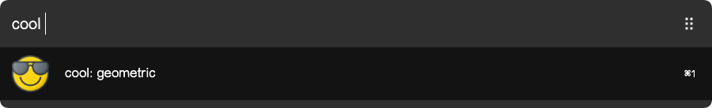

# arvis-cool

> arvis workflow to find cool words.



## Install

```
$ npm install --global arvis-cool
```

## Usage

In arvis, type:

* `cool`: to get a random superb like word
* `cyes`: to get a random yes like word
* `cno`: to get a random no like word

Select the word to copy to clipboard.

## License

MIT © [Duoc Nguyen](https://12bit.vn)

## 🔗 This workflow is converted from [alfred-workflow](https://github.com/nguyenvanduocit/alfred-cool).

* Note that there might be some code change or different actions from the original workflow.

* Marked original workflow's creator to author.
